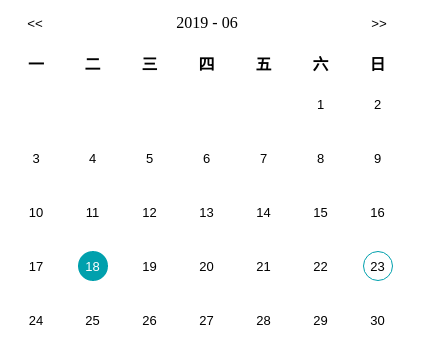

React Hooks 出来这么久了，一直没用过，刚好有需要一个简单点的日历组件，没找到合适的，于是干脆自己动手，刚好实践一下 Hooks 。

开发好的组件我上传到了 github，如果有学习需要的同学，欢迎自取：
[https://github.com/posebear1990/react-simple-component-calendar](https://github.com/posebear1990/react-simple-component-calendar)

最终 demo 在这里可以看到，可以看到是个很简单的日历组件：
[http://demo.xiaoxiaoxiaoxiong.com/react-simple-component-calendar](http://demo.xiaoxiaoxiaoxiong.com/react-simple-component-calendar/)

开发起来也并不难，但是思路却是开发一般的 React 组件的通用思路，所以简单介绍一下开发思路，并且记录一下从设计到发布到 npm 的全过程。

## 设计 API

写组件的第一步是设计 API，API 的根据则是我们组件的用途。



如图，这个日历组件的主要是我用来展示每天的技术日志，因此 API 可以不用太复杂。

| Prop    | Type       | Description                                                    |
| :------ | :--------- | :------------------------------------------------------------- |
| list    | `Array`    | Every props you what to apply to button element                |
| now     | `String`   | Timestamp which you what to mark today (will border highlight) |
| onClick | `Function` | When your click date element will trigger                      |

三个 props 的作用分别如下：

1. list 是我们用来高亮具体某天的列表，在日历组件上以墨绿色底色显示。
2. now 则是代表这今天，在日历组件上会高亮边框。
3. onClick 比较简单，就是点击后的行为。

## 写个测试用例

所谓巧妇难为无米之炊，要继续开发，接下来当然是先写好测试用例。注意，这个测试用例并非为了测试用的，而是方便我们继续接下来的开发。

在 example 目录下新建一个 Example.tsx 文件，代码如下：

```javascript
<Calendar
  list={[
    {
      className: "active",
      time: 1560787200000
      // & every what fuck you want set on date element
    },
    {
      className: "active",
      time: 1553881332850
    }
  ]}
  now={new Date().valueOf()}
  onClick={(date: Date, item: ListItem): void => {
    console.log(date, item);
  }}
/>
```

## 配置 webpack

以上我们写了一些代码，但是到目前都还是没法运行的，要继续开发得先配置好 webpack。其实如果特殊原因完全用 create-react-app 就可以，不过对我来说，webpack 个性化定制起来太过繁琐，eject 之后的配置又太过复杂，很难处理，于是选择自己写配置。

具体配置过程写出来显得繁琐，反正也不复杂，就不赘述了，值得注意的是两点。

第一是我们这个组件用了 Typescript，为了解析 tsx 文件用到了
`awesome-typescript-loader` 这个 loader。  
第二是样式用 less 书写，所以用到了`less-loader`。

## 开始正式编码

配置好 webpack 就可以编码了，`npm run dev`，然后打开我们的开发服务器地址，现在是空白的页面。

### 定义 DOM 结构，确定样式

有人会选择先写逻辑，我的做法是先写个静态的组件出来，既先给出 dom 结构，然后写好样式。事实上先写逻辑也是可以的，不过不太好想象组件长什么样子，所以我的建议还是先写好样式。

dom 结构大致如下，为了观看体验，删除一部分。

```html
<table class="react-simple-component-calendar-table">
  <thead>
    <tr>
      <th><span>一</span></th>
      <th><span>二</span></th>
      <th><span>三</span></th>
      <th><span>四</span></th>
      <th><span>五</span></th>
      <th><span>六</span></th>
      <th><span>日</span></th>
    </tr>
  </thead>
  <tbody>
    <tr>
      <td><button class="react-simple-component-calendar-button"></button></td>
      <td><button class="react-simple-component-calendar-button"></button></td>
      <td><button class="react-simple-component-calendar-button"></button></td>
      <td><button class="react-simple-component-calendar-button"></button></td>
      <td><button class="react-simple-component-calendar-button"></button></td>
      <td class=" ">
        <button class="react-simple-component-calendar-button">1</button>
      </td>
      <td class=" ">
        <button class="react-simple-component-calendar-button">2</button>
      </td>
    </tr>
    <tr>
      <td class=" ">
        <button class="react-simple-component-calendar-button">3</button>
      </td>
      <td class=" ">
        <button class="react-simple-component-calendar-button">4</button>
      </td>
      <td class=" ">
        <button class="react-simple-component-calendar-button">5</button>
      </td>
      <td class=" ">
        <button class="react-simple-component-calendar-button">6</button>
      </td>
      <td class=" ">
        <button class="react-simple-component-calendar-button">7</button>
      </td>
      <td class=" ">
        <button class="react-simple-component-calendar-button">8</button>
      </td>
      <td class=" ">
        <button class="react-simple-component-calendar-button">9</button>
      </td>
    </tr>
  </tbody>
</table>
```

class 命名用了 BEM 的规范，主要是实践起来简单有效。

### 编写渲染逻辑

写好了 dom 结构和样式，意味着最终渲染出来的界面我们已经有了。

对于 react 组件来说 最终 UI = render(data)，数据 data，我们已经在测试用力里确定了，剩下的就是写渲染逻辑了，就是怎么把 data 转化成我们最终要的样子。

这个时候要思考一个问题，就是需要实现我们的最终目标，到底需要多少个状态？

**我觉得这是关于组件如何实现的有趣的点，软件设计有个原则叫 KISS，既 Keep It Simple, Stupid， 保持简单。** 我觉得这个原则在大部分时候都是适用的。或许你的设计最终会因为现实而变得特别复杂，但是至少在软件设计的第一步，我们需要保持尽量简单。

拿这个日历组件举例，如果我们的目的是选中某一天，那么首先确认组件状态设计有表示日期的年，月，日三个状态是不是很合理？然后还需要确定这一页的日历有多少天，再设计一个 month days 是不是也还不赖？然后确定这一月的第一天是从星期几开始的，再设计一个 first day 是不是比较合适？

但事实是，只需要一个状态：这一天在哪个月，就可以确定某个月的界面。

组件拥有多个状态，可以减少渲染过程的计算量，但却带来了同步组件各个状态的复杂度。
高纳德有句被普遍曲解的话，叫过早优化是万恶之源。虽然被曲解了吧，但是这个原则却非常适合软件开发，而且越接近业务层面的开发，这句话价值越大，因为需求是变化的嘛。

既然我们决定只用一个状态来做渲染，用 date 来保存日期，通过日期确认具体在哪个月，通过这一天在哪个月来渲染出最终界面。
实现的代码大致如下（做了一些简化）：

```javascript
const [date, setDate] = useState(new Date(now));

const data = getCalendarData(date);

return (<tbody>
{
  data.map((weekList, i) => (
    <tr key={i}>
      {weekList.map((day, j) => (
        <td key={`${day}${j}`}>
          <button className="react-simple-component-calendar-button">
            {day}
          </button>
        </td>
      ))}
    </tr>
  ));
}
</tbody>);
```

可以看到还是很简单的，实现复杂度在 getCalendarData 函数里，但其实也很简单，以下说下思路，具体的实现请看代码：

[https://github.com/posebear1990/react-simple-component-calendar/blob/master/src/utils.tsx#L21](https://github.com/posebear1990/react-simple-component-calendar/blob/master/src/utils.tsx#L21)

思路是首先算出来这个月有多少天，然后再算出来这个月第一天是星期几，然后按照总天数从第一天开始依次往后递增知道就可以得到这个月的视图数据。这个月第一天之前的数据用 -1 来表示，表示这一天是不用渲染的，2019 年 6 月最后计算得到的数据大概长这个样子：

```javascript
[
  [-1, -1, -1, -1, -1, 1, 2],
  [3, 4, 5, 6, 7, 8, 9],
  [10, 11, 12, 13, 14, 15, 16],
  [17, 18, 19, 20, 21, 22, 23],
  [24, 25, 26, 27, 28, 29, 30]
];
```

接下来就是把 list 的数据绑定到 dom 上，实现上用到了 `useMemo` hooks 函数做了优化，考虑到 list 可能很大，而且在使用过程中几乎不会发生，所以做这点优化还是比较合适的，并非我们刚才谈到的过早优化。

### 编写测试

这个项目是开发好之后才补的测试，业内更倡导 TDD ，但是我不觉得之后补测试有什么不妥。因为在我看来单元测试的目的在于软件的部分实现修改后，不影响到其他部分，因此之后补测试的做法也没什么问题。  
实践上要注意的问题是软件的修改后一定要去响应的修改测试，而不是用暴力的方法通过测试。

关于测试粒度，我个人认为保持粗粒度的测试就可以，比如在我们的例子里我的测试就只覆盖到通用方法 `utils.tsx` 里导出的方法。

对于组件，甚至组件 dom 的测试也许更能保证修改组件之后组件行为的正确性，但是写起来成本还是有点高，还有 UI 变化通常是比较快的。变化快，写起来复杂，计算下来性价比不算太高，所以我自己通常是不写组件的测试的，即使我不反对这是保证组件正确性好方法。

## 打包

因为我们是用 ts 开发的组件，打包成 js 代码还是很有必要的，打包可以用 babel 但是 babel 不会自动生成对应的类型声明文件，所以我们这里用用 tsc 进行打包。

配置好 `tsconfig.json` :

```json
{
  "declaration": true
}
```

直接 tsc 搞定。

## 发布

发布到 npm 可以带上源码，这样用户可以直接在 node_modules 里看到源码。但是不要带上 example doc 目录等，因为这些目录有可能存在静态资源，白白增加 npm 包的大小，超过了 npm 的限制就不合适了。

我们见过很多以 @ 开头的包，这是怎么做到的呢？我们的例子里，直接使用 @react-simple-component/calendar 发布是不行的，必须先到 npm 添加一个组织 @react-simple-component，然后就可以用这个组织名为域，在这个域下发布各种包了。

## 总结

总结一下，我们以日历组件为例，简单描述了一下开发一个 react 组件的通用流程，依次是设计 API ，写测试用例，配置 webpack，编码，打包，发布。文中给的代码都是简化后的代码，需要学习的还请去 [github](https://github.com/posebear1990/react-simple-component-calendar) 查看源码。
