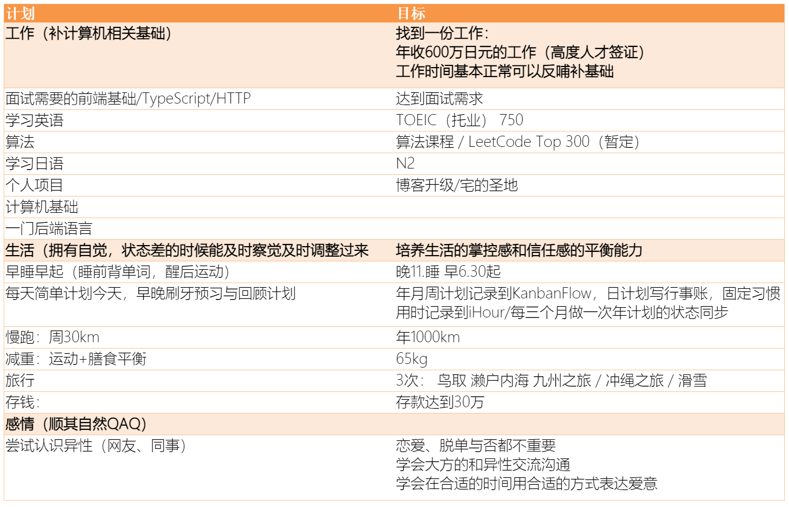

### 2020 目标回顾
去年的计划是发在饭否的，140个字让我不得不精简到只列了最重要的 5 条，即使这样完成状况依然堪忧：

**1.瘦到 65kg 不过对体重没执念，体脂率下去也行** 
没做到，这一年里体重经历几次过山车，但也是一直在 70 ~ 75kg 之间徘徊，朝 70kg 努力了几次都没有成功，最后了解到了调定点理论，这种理论说人有一个固定的体重区间，掉下去就会迅速涨上来，反而涨上来之后也不容易变得更高。这到不至于使我绝望，但让我认识到减到 70kg 以下会非常的困难。不过，还是会努力。

**2.攒十万人民币，虽然对钱没欲望，但月光是不行的，需要攒点钱以备不时之需** 
做到了，且没花太大力气。

**3.琵琶湖环湖+爬富士山**
环湖做到了，富士山今年封山。2020，相信任何一个人都没有把疫情规划在内。

**4.画一个完整32页左右的短篇漫画**
画了几页分镜头之后，制作草稿的时候被自己的渣画力着实打击到了，加之上班之后业余时间短缺，就没有再继续了。今年也没有继续精进的打算，曾经有些天真的想法，但现在的现实里有更重要的事情需要我来完成。当然，即使如此，作为一个业余爱好来培养，依然是轻松愉快活泼可爱的。

**5.把大前年开始看的操作系统 MOOC课上完**
没看，即使我把计算机基础列成今年计划的一项，也依然拍了很靠后的优先级。

总结一下，虽然去年列出的目标很少，但是由于没有经常对照总结，导致现实和计划脱节严重，可以说我生活就完全不是按照计划来过得。单看计划的话，可以说2020是失败的一年。
然而也不是，这一年我第一次习惯了在异国他乡的东京生活，保证安全的前提下也去了不少地方旅游，和同事建立了良好的关系，培养了相较以往更健康的生活习惯，还有最重要的一点，在远离家人的情况下的独自生活，让我对如何处理家人的关系有了更深的理解。

### 2021 的计划与目标

正如 2020 总结里提到的，我在生活和社交上面取得了不少进步，可惜唯独忽略了工作，终于在年底陷入了巨大的失业危机。和公司领导，以及和年轻人的对谈里让我不断意识到自己过去一年在工作方面做的有多糟糕。达里奥说痛苦加反思等于进步，我越来越相信这句话，因此觉得有必要在新的一年里做些技术规划，在技术和工作上面更进一步，才能不至于淘汰出局。
虽然我自嘲自己不适合工作，但为了生存，现阶段并没有更好的选择，因此在新的一年里，我决定将重点放在**学习和工作方面**，其他方面规划则为此铺路。虽然深知这些计划年底未必能完成一半，但即使如此，依然能够为未来更进一步奠定基础。
另外，形式上则剥离了计划和目标，计划侧重于要做什么，目标则是要达到什么样的成绩，之所以选择这样做也是因为从工作中学习到的，**有目标清晰，计划才能更好的实施**。

最后稍微总结一下，从上面的计划里可以看出来，比起上一年，今年的计划量更大，而且要求都不低。
一个点是因为去年虽然工作上没有太大进步，但渐渐适应了高强度的工作方式，我觉得做自己的事情应该投入更大的热情才是。尽管今年会很累，但我依然有相信能在忙碌和健康方面做出一些平衡。
另一点是，既然是超量计划，那么完不成是必然的。所以表格的顺序其实就是每个计划的优先级，按照优先级来做。**所谓要事优先，才能发挥时间的最大价值。**
