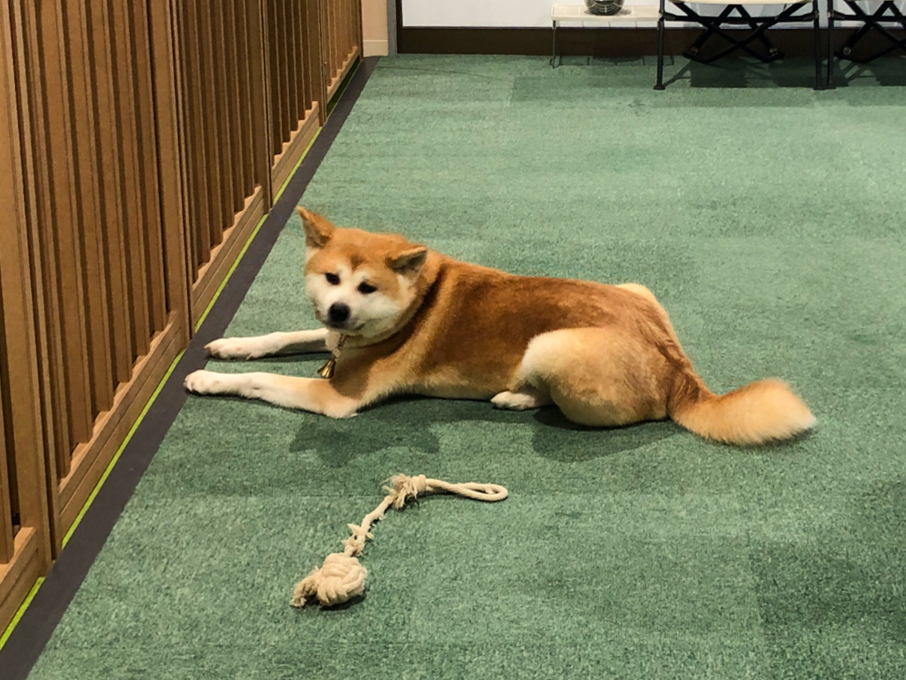

活在当下是最近这几年比较流行的说法，但其实只要人类还没有掌握时空穿越的技术，人人都还是只能活在当下。玩文字游戏既然没意义，活在哪里，就还只是一种**从时间的角度来拆分的，对于当下生活的态度：**
**活在过去**，意思是沉湎于过去的辉煌，或者被不断拉回过去失败的经历里，看不到未来。想当年我怎么怎么样，原生家庭对我的影响太大了，几段失败的恋爱经历让我不能继续向前……
**活在当下**，这是比较正面的态度，指的是能专心于手头的事情，体会当下的情绪，享受当下的生活。
**活在未来**，指沉迷于未来的幻想，或被对未来的担忧所笼罩。好事会发生的吧，总有一天能学号英语吧，毕业了应该能找到女朋友吧？（公司给你发还是怎么着？）老板叫我下班去办公室谈话我要死了！

以上是常见的时间态度，我曾经试着用它们来指导我的生活，多次尝试之后都失败了。但我依然不认为活在当下是一个错误的观点，我做不到，只是因为真的太难了。
完全是因为我自己啊，我自己既是那种失败过一次就再也不敢尝试的胆小鬼，也是那种一点小事就会影响心态，没法好好工作生活的人。

比如虽然我已经工作快五年了，遇到领导冷不丁的来一句，今天下午我们稍微谈一谈，或者明天中午来我办公室一趟。都还是会瞬间汗毛直立，并且在发生之前的这段时间几乎没法安心工作。
另一个例子是我对未来的规划，毕业之后换了三份工作，从北京上海西安一直漂到东京，也没想好未来要到哪里发展，并且还在为此隐隐的焦虑着。
还有我的顾虑，我每次换工作都会想很多，想会不会辜负父母的期望，要不要回老家发展，未来的女朋友要找哪里的（实属想多😆）。

类似的例子还有很多，这些都持续困扰着我，好在我自己的思考也在继续。逐渐意识到，作为一个普通人，**追求活在当下，但没必要做到活在当下**。
这是活在当下的一个重要方法——冥想，带给我的一点小启发。冥想过程中有个很重要的点，是当有杂念经过的时候，想象自己是马路边的小房子，让杂念像汽车一样驶过就行了。
对当下态度也大可以采取类似的处理，**感受到对过去有的执念，和对未来有焦虑，察觉到，也由他过去，继续做好当下要做的事就好。** 在这个过程中，或许会不断地重复感受到过去的执念和未来的焦虑，但还是做好当下的事。

我知道这个方法有些抽象，这其中最关键的是放弃对抗，不去纠结也不去对抗，那么由时间引发的各种情绪，就不会真正的影响到我们当下在做的事。
但是还是要说一点这和逃避有着本质的区别，逃避是在没有察觉的状态下做出的反应，而平和心态，则是在察觉的情况下做出的选择。

去年看了积极心理学，有个启发是从问题的反面来思考，这个反面不是对立面，而是像图片处理软件里的选区反选。有些问题从正面很难描述，那么你反过来把它的环境描述清楚，它就清楚了。这就好比透明人本身是看不到的，但是在他周围的空气上撒一包面粉，他就露馅了。有个例子是，既然我们很难改掉坏习惯，那用想达成的事情把坏习惯的时间给挤占掉，那么就改掉坏习惯了。
对于时间的态度也是如此。我刚才的描述太过抽象：**对于过去的执念和未来的焦虑要由它们过去。** 但这就好比房间里的大象，让我们不去想它，我们反而更容易注意到他们。

所以我决定反过来，从反面找些可以行动起来的方法，都是我的方法，不一定适合你，但是可以看看，做个参考。
**对于过去，做好记录**
这里说的记录并不是指回忆过去，而是记录好现在，毕竟现在终将成为过去。
记录的方式多种多样，我自己的话拍照和拍视频是一直都在做的，短的思考和情绪的流露会发饭否，长一点的思考从今年开始写豆瓣日记。
记录的目的，不光在于有一天可以有材料来回忆过去的美好生活，而且还能培养一种乐观积极的生活态度。喜欢上记录之后，我渐渐变成了体验派，这是我自己发明的词，以为人生就是体验各种各样的事情。
比如上次去东北的旅游经历，早上赶车发现五能线受大风影响被取消了，临时改行程去了大馆市，结果坐错车多花了一个小时，没过膝盖的雪里走了半小时，看上去好惨啊，但我只是当成一个旅途经历，而不会影响到心情。最后还是成功看到了秋田犬，虽然波折，但也是一种很好的体验嘛:)
**对于未来，做好规划**
不同的时间节点的事情，需要分清轻重，比如我自己看来：身后事是不需要关心的了，所以我不认为结婚生子是必须的选项，即使我还不到三十岁，并且渴望爱情。而未来十年很关键，这甚至决定了我的老年生活。未来一年则最重要，马上就会到来，且现在发生的事情对未来一年的影响马上就能被验证……
分清不同时间点的轻重，会让我们在做决策的时候少很多的后顾之忧。
因为有些事情不需要立刻的结果，比如职业规划，但是要时常拿出来思考一下。事实上我的待办清单里就有一项是每3个月审视一下自己的职业规划。这些事情，即使一直摆在那里，但是我们有定期的思考，不断推进也就不害怕为此而焦虑了。
还有就是，做计划分清目标和行动，把目标变成行动，注意力放在行动上，那么尽力了还达不到目标，也就不必那么纠结了。

以上，是我自己的实践，生活虽然依然很艰苦，但是对过去和对未来的态度越来越明确，不必追求任何违背内心的目标，不去迁就任何与未来生活无关的人，至少心理状态还是在渐渐变好的吧。
总结一下，所谓的活在当下，最好的方式，或许就是用对待当下的态度来对待过去和未来吧。

最后的最后，分享一个冥想练习的小技巧，我自己试过冥想，对注意力改善很有帮助，但是冥想仪式感过于强了，反而不好坚持。后来在 Twitter 上看到一个闭眼单脚站立的小练习，作为冥想的平价替换品，觉得很简单也很有效，分享给大家。
* 闭上眼睛，抬起单脚
* 数60秒
* 保证安全，在椅子旁边做练习，撑不住的话就扶一下

后记：这篇文章太长了，但是还想记录一下写作感受，开始写的时候，一些想法还不是很明确，而且比较乱，不知道怎么组织到一起。起源也是因为一些关键词，突然产生了对未来态度的思考，才觉得写一篇文章记录一下。写的过程中又发现这个话题还是太大了，先谢谢当下的时间观念。
这里面还有不少想法没能包含进来，或许会和这篇文章有不少重合之处，会在以后的思考里逐渐成型吧。其实这也是我来记录的一个目的，因为不光可以记录下自己凌乱的思考，也能通过慢慢的延伸和剪枝把想法梳理清楚。
嘛，这篇就是这样，谢谢大家关注，点赞，收藏，谢谢:）

