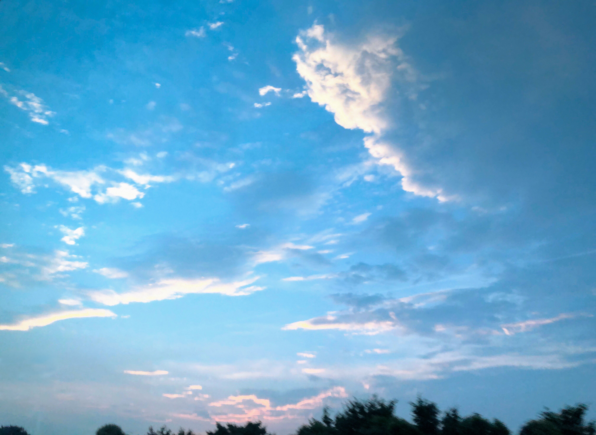
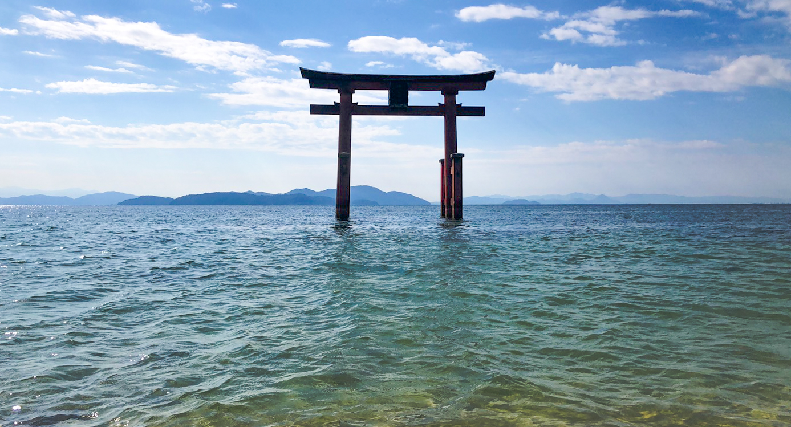
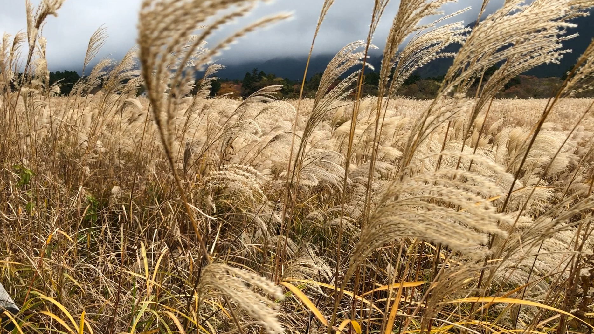

一月，新年第一天，买了青春18车票去金泽旅行，七天时间走了金泽-富山-高山-神户-京都-名古屋，车很慢，相当累，收获了在路上的乐趣。

二月，来东京三个多月，差不多稳定下来，开始考虑找房子。一个人跑到市川站附近，用吃力的日语和中介交流，看了几间都不太合适。第二天通过会中文的中介才找到合适的房子。天气虽然寒冷，有些樱花已经开了。

三月，临近搬家的时候，早上晨跑结束，发现附近的樱花已经冒尖了。这里真的挺好的，可惜太偏，上班不方便。

四月，搬新家一段时间了，生活逐渐安定下来。疫情依然严重，不敢出去吃饭，只好自己在家做。虽然不会做饭，但是咱会P图。

五月，在家办公快三个月，自己的业余项目又忙了整整两个礼拜，憋太久了，约同事去踢球的路上拍到了漂亮的图片，从此发现了拍照的乐趣，不管去哪都会带着相机，也学会了做基本的后期处理。

六月，解锁了拍照的乐趣后就一发不可收拾，下班后去逛公园还不满足，利用周末转遍了皇居，东京塔，晴空塔等东京市内的地标建筑。

七月，工作负担开始变重，生活也不再有新鲜感，那段时间过得比较痛苦，月末的一个连休，约同事去爬山散散心，被拒绝了。只好一个人去了饭能，《向山进发》的取景地。爬到半山开始下雨，山里一个人都没有，担惊受怕中完成了接下来的行程。

八月，戒掉了玩了两个月的手游，恢复了作息，晨起跑步，傍晚节食，生活开始有了掌控感。月初一个人去爬了筑波山，月中送离职的同事回台湾，月底和同事去了江之岛。

九月，开始迷恋看电影，每个周末都会顶着疫情和日语的压力去看电影。月底借着四连休请假去滋贺，实现几年前环琵琶湖的愿望。三天骑行220公里，东京-岐阜-大垣-米原环湖开始-高岛-大津-丰乡-米原环湖结束-京都-宇治-东京，满足，且累的够呛。

十月，旅游后综合征，干什么都打不起精神。更新了签证，看了鬼灭之刃的剧场版，看了堀口悠纪子的原画展，去月岛故地重游，买了XGP会员，买了一个小沙发，开始玩微软模拟飞行，开始沉迷手办和拍塑料小人。

十一月，公司业绩下滑，每周多了一个休息日，有些担心但是没做更多准备。去了箱根EVA圣地巡礼，逛博物馆。抢购的 Xbox 主机到了开始沉迷游戏，也开始担忧下个月的日语等级考试，试图恢复作息，但失败了。

十二月，临时抱佛脚准备N3考试，恰逢新功能上线，忙的昏天暗地。定了东北的新干线之旅，东京-新泻-秋田-大馆-宏前-青森-东京，见到了心心念念的大雪。本想就这样给今年画上一个完美的句号，没想到陷入了巨大的职业危机。

