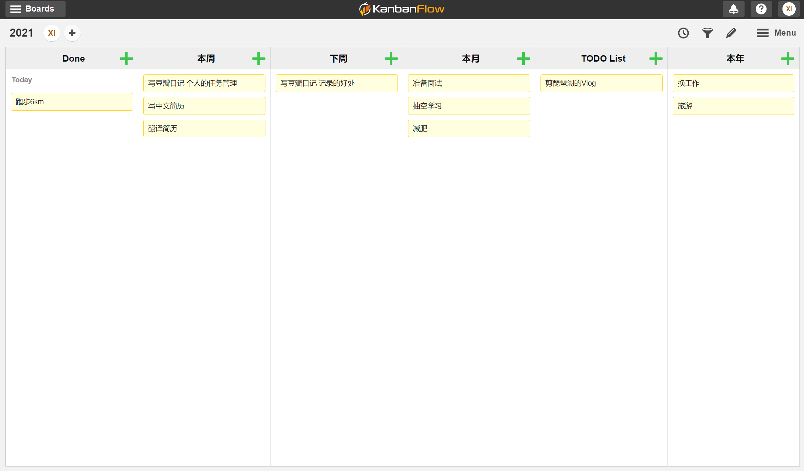

**人人都需要任务管理**
任务管理，因为这个词经常和 KPI ，项目管理什么的捆绑在一起，所以越来越变得像是企业对员工进行压榨用的工具而含有贬义，但是我依然觉得人人都需要任务管理。
因为现代不同于古代，绝大多数人会接触更多的信息，欲望得到更多刺激，娱乐方式也变得多种多样，同时为了生存还不得不花大量时间来工作，这一切都会导致现代人必然是时间不够用的一帮人。
如何利用本就不够用的时间，来实现自身的目标就变得相当重要了。而任务管理，作为规划时间的工具，就是来帮助我们实现这个目的的。
是否只有闲的人需要规划时间，忙的人是不是就不需要规划时间？其实关于这点有个悖论，就是**忙的人会更懂得利用时间**。这是我自己的心得体会，在我刚换第二份工作的时候，每天工作忙到八九点才下班，完全没时间做别的事，这让我意识到时间的宝贵。现在博客里的一些技术博客，技术日记都是那段时间完成的。后来又换了工作，闲下来了，反而倦怠了，光想着爬山和旅游了（其实也挺好🤣）。

**要事第一**
如果用一个词来描述个人的任务管理的话，那就是**要事第一**。这个词已然成为了我的原则之一，之前的文章里也有提到，之后的文章里还会不断的提到。因为虽然很简单，但是太重要了，以至于我要不停的提到。
关于这个词，我的解释很简单，就是做最重要的事。至于要不要用四象限法则，要不要把最重要的事安排成每天的第一件事，我觉得可以灵活对待，不需要教条。虽然很多相关书籍都会提到各种方法，但我都没用到，对我来说重要的事，我会给个较高的优先级，并且专门安排时间来做，仅此而已。

**使用方便且功能强大的任务管理工具**
像我这么务实的友邻，不给一些具体工具的推荐那是不可能的。毕竟关注了时间管理和效率相关的人，几乎不太可能不是一个工具控，夸张点说我们时间管理省下来的时间，都用来寻找相关工具了。在这里，我先点评一下用过的各种工具，然后给出我现在在使用的工具。

首先是**日历类**，比如Google Calendar，各个系统自带的 Calendar。
日历类应用的好处是可以切换视图，而且创建的日程到期的时候都会提醒，而且还可以创建周期性的任务，比如每周日提醒你买菜（其实买菜根本不需要提醒🤣）。
以上提到的各种好处，让日历作为任务管理工具来说几乎是个终极的解决方案。只是，对我来说，对绝大多数人来说，它都太麻烦了。创建一个任务，得点开app，点新建，然后输入任务内容，选时间，选要不要提醒……而我，只想买个菜啊，PASS。
其次是**清单类**，比如 To-Do List，滴答清单，还有系统原生备忘录， Taskade 等各种清单类应用。
对于绝大多数人，清单类的应用其实就足够了，每天早上工作前整理一下当天的清单，完成后划掉就是了。
对我来说，之前的绝大多数时候也都是在用各种清单类的工具，典型的使用方式是这样的，每年的计划建一个年计划清单，每个月会建一个月清单，每周的任务建一个周清单，然后每天上班第一件事，把今天的任务整理出来放在当天的 To-Do List 里，完成的划掉，规划外的移动到一个专门的 To-Do List 里。

这个方法相对来说还是轻松合理的，但对我来说有个问题是，作为App，不论是什么平台，有个天生的属性就是会被当前活动的 App 遮挡住，因为人类是视觉动物，缺乏提醒的时候就不太会想起这个 App 了。于是我每天的 To-Do list 基本都只会在新建的时候看一眼，然后第二天新建的时候把昨天的完成的勾掉，然后新建今天的。类似的，周清单在下周周一新建的时候才想到会看一眼……这样下来，很难说清单对当天的工作和学习安排有什么帮助。
而且说到天然遮挡的属性，大多数的清单类应用里，年清单，周清单，月清单，日清单，还有其他待办事项也是相互遮挡的。在我的理想方式里，月清单应该来自于年清单，周清单应该来自于月清单，日清单应该来自于周清单。但因为遮挡的原因，新建一个清单的时候，很难想起看一下他的上层清单。
基于以上两点吐槽，我需要一个**使用方便且功能强大的任务管理工具**。好在我还在不断的寻找更好的工具，多种尝试后找到了满足目前需求的工具：

**KanbanFlow + 纸质To-Do List**：
KanbanFlow 其实只是一个看板工具，和任何一个看板工具使用起来都没差，具体还是看使用的方法了。我使用的方式如图，隐私原因，造了点假数据，大家理解意思就好：

就像之前说过的，大部分清单工具都会存在相互遮盖的问题，但是看板类工具并不会有这个问题，大部分看板是从 To-Do 到 Processing 到 Done 的状态，但是我只用来当清单使用的话并不需要这些列。
于是我删除了这些列，并且根据自己的需要专门建立了**年月周**的列来放对应的清单。这样在更新每个月任务的时候也会看到年计划，更新每周的任务的时候也可以看到月计划。
除此之外，
**TODO List** 这一列主要放一些有意向，但是没有明确什么时候会做的任务。
**下周** 这一列则是放近期时间相对明确的任务，比如把本周做不完或者规划外的拖过去。
另外排列也稍微花了点心思，并不是从左到右的年->月->日的顺序，一来是我觉得最重要的东西应该放在最显眼的位置，二来是屏幕如果窄一点，后面列的东西就看不到了。
最后是唯独缺少的**今天**这一列，因为我们之前提到的，软件或者 App 的天然缺点，就是会被其他软件遮挡。土豪点的解决办法是多买一块屏幕就只放这一个应用，但无奈在下家境贫寒🤣，我的方法是用**纸质的 To-Do List** 来写当天的任务。
说是纸质 To-Do List，其实就是个小本子，同时因为害怕麻烦，我也没用手账一类的东西，就是一个普通的用来随意写写画画的本子，讲究一点的友邻可以用手账来代替。

KanbanFlow 相对于其他看板类工具的一个优点是自带了番茄钟，事实上这也是最早吸引我使用它的一个点。番茄钟可以有效帮忙聚焦目标，集中注意力，就不多赘述了，考虑到不太可能单独为它写一篇文章，这里也顺路再次建议大家坚持使用。

KanbanFlow + 纸质To-Do List 对我来说几乎是完美的工具了，但是依然有两个已知的缺点，一是 KanbanFlow 是 Web App，没有移动端的原生应用，交互上相比原生应用的使用体验会差很多。安卓上可以安装对应 PWA， iOS 得自己新建一个书签丢桌面。
另一点是纸质 To-Do List 不好归档，我又懒得用专门的行事账或手账，只好作为逼死强迫症的一个小点用毅力强行克服一下了。

以上就是关于任务管理工具的全部内容了，其实工具终究还是一个工具，作为工具必然有工具的局限性。对于需要长久坚持，并且有益的事情，还是培养成习惯会比较好。然而说是这样说，习惯养成对我来说依然是怎么都做不好的事，如果各位有经验，欢迎评论里告诉我。

ps：如果这篇文章对你有帮助，那么可否求个关注叻，因为之后写的东西说不定也对你有所帮助❤。
